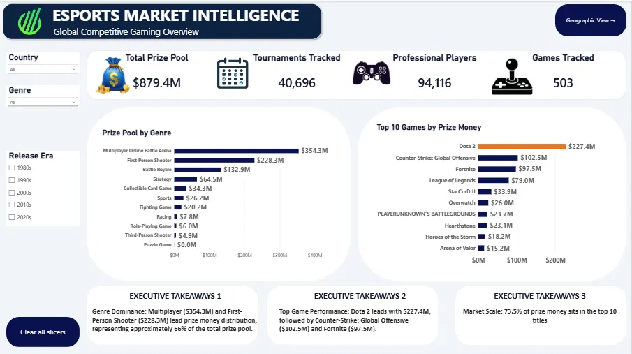
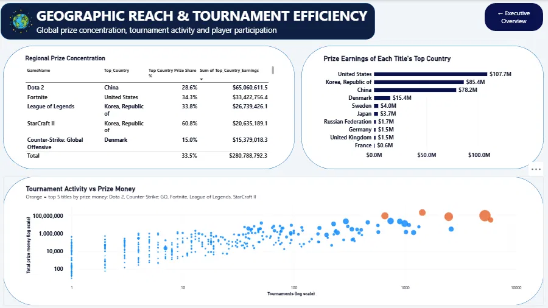

# Esports Market Intelligence — Power BI Capstone

An interactive Power BI dashboard and executive analysis built for a fictional sports entertainment and investment firm evaluating market entry into competitive gaming (esports). The project covers data cleaning, data modelling, DAX measures, dashboard design, and investment recommendations based on the findings.

**Author:** Ajayi Oluwatimilehin Benjamin — Data Analyst
[LinkedIn](https://linkedin.com/in/benaj619) · [Portfolio](https://benaj619.my.canva.site) · benaj619@gmail.com

---

## Project overview

A firm's leadership needed to decide **whether, and where, to invest capital in competitive gaming**. Using a dataset of 503 game titles, I cleaned and modelled the data in Power BI, built a set of core DAX measures, and designed a two-page dashboard to answer three questions:

1. Where is the money — which genres and titles concentrate the market's prize pools?
2. Which games use money efficiently — prize per player and per tournament, not just totals?
3. Which titles depend on a single country — relevant to sponsorship and geo-targeting?

## Key findings

- **$879.4M** in cumulative prize money tracked across **503** titles and **40,696** tournaments.
- **73.5%** of all prize money sits in the top 10 titles alone.
- **MOBA** is about 40% of the market from only 22 titles; MOBA + First-Person Shooter together are roughly 66%.
- **Fighting games** are the most numerous genre (160 titles) but earn only ~2.3% of prize money — a **14x** efficiency gap versus MOBA on a per-player basis.
- Some flagship titles are heavily tied to one country: **Halo 2** is ~93.5% US, **StarCraft: Brood War** is ~91.8% South Korea.

## Dashboard

### Page 1 — Executive Overview
Market size, genre concentration, and top-earning titles, with slicers for Country, Genre, and Release Era.



### Page 2 — Geographic Reach & Tournament Efficiency
Regional prize concentration, each title's leading country, and a log-scale scatter of tournament activity vs. prize money.



*A third page (hidden) supplies hover tooltips with per-title average payout figures.*

## Data & methodology

**Pipeline:** CSV → Power Query → Data model (fact table + dedicated `_Measures` table) → DAX → Dashboard

**Dataset:** `ESport_Earnings.csv` — 504 records: game title, genre, total prize money, player count, tournament count, top-earning country, and release year.

**Cleaning decisions:**
| Issue | Resolution |
|---|---|
| 48 rows with a null `Top_Country` | Replaced with `"Unknown"` so no rows are excluded when a slicer or filter is applied |
| Release year typo (`11` instead of `2011`) | Corrected via a conditional transform in Power Query |
| Duplicate title (Battalion 1944, one row empty) | Kept in the 504-record table; `DISTINCTCOUNT` counts it once (503 unique titles) and the empty row adds zero to every total |
| Untyped money/count columns | `TotalMoney` and `Top_Country_Earnings` set to fixed decimal (currency); `PlayerNo` and `TournamentNo` set to whole number |

**Core DAX measures:**
```dax
Total Prize Money = SUM(ESport_Earnings[TotalMoney])
Total Tournaments = SUM(ESport_Earnings[TournamentNo])
Total Players = SUM(ESport_Earnings[PlayerNo])
Avg Prize Per Tournament = DIVIDE([Total Prize Money], [Total Tournaments], 0)
Avg Prize Per Player = DIVIDE([Total Prize Money], [Total Players], 0)
Top Country Prize Share % = DIVIDE(SUM(ESport_Earnings[Top_Country_Earnings]), [Total Prize Money], 0)
Unique Games = DISTINCTCOUNT(ESport_Earnings[GameName])
```
`DIVIDE()` is used throughout instead of the `/` operator so titles with zero recorded players or tournaments return `0` rather than an error.

## Strategic recommendations

1. **Anchor in MOBA and First-Person Shooter** — together ~66% of prize money, with MOBA paying the highest amount per player.
2. **Test Battle Royale as an emerging genre** — only 11 titles, yet ~15% of prize money and roughly 5x the market's average payout per tournament.
3. **Use regional concentration for targeted deals** — titles tied to one country suit geo-targeted sponsorships; low-yield, high-title-count genres (e.g. Fighting) are better suited to community-level spend.

## Notes & limitations

- "Professional Players" sums `PlayerNo` per title, so a person competing in two titles is counted twice — read it as player entries, not unique individuals.
- `Top_Country` and `Top_Country_Earnings` record only each title's single leading country, so the country chart shows *dependency*, not that country's full national esports earnings.
- Titles with zero recorded prize money, players, or tournaments were kept rather than removed, since they are real, valid records.

## Repository contents

| File | Description |
|---|---|
| `Esports_Market_Intelligence_Case_Study.pdf` | Full written case study: overview, methodology, findings, and recommendations |
| `Esports_Market_Intelligence_Presentation.pptx` | 9-slide investor presentation with speaker notes |
| `Esports_Market_Intelligence_Dashboard.pdf` | PDF export of the two dashboard pages |
| `ESport_Earnings.csv` | Source dataset (503 titles after cleaning) |

## Tools

Power BI Desktop · Power Query · DAX · Excel

---

*This project was completed as a capstone in a data analysis learning program.*
